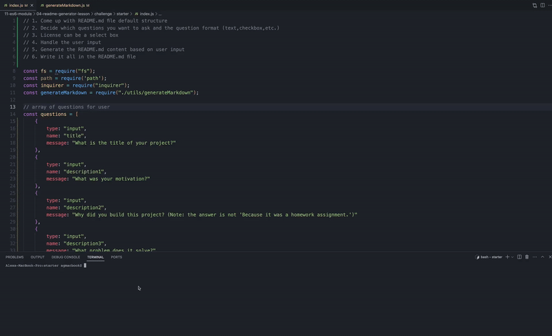

# Professional README.md Generator

## Description
My motivation was to create an automated tool that can take user input and generate readme documentation files.
I built this project because I am faced with having to create documentation for my projects every time I create something new and I needed a tool to streamline my workflow.
The app solves the problem of having to research for the correct file structure and other nice to haves such as a table of contents and badges for the technologies used in the making of your project.
I learned that node.js is a very powerful automation tool and that is essential to run server-side applications.
What makes my project stand out is that it solves a real world problem that many developers face every time they finish a new project.

## Table of Contents
- [Installation](#installation)
- [Usage](#usage)
- [License](#license)
- [Contributing](#contributing)
- [Tests](#tests)
- [Questions](#questions)

## Installation
To install this project, open the terminal and simply run the command 'npm install' inside the folder of this repo, once all dependecies are installed run the command 'node index.js'.

## Usage
The project should be used any time you need to create documentation for your GitHub repository.
The following image shows the web application's appearance and functionality:

## Tests
Does not require testing.

## Contributors
Alex Grigore

## Questions
For questions about the project, you can reach me at [GitHub: agworkgit](https://github.com/agworkgit) or contact me via email at agworksbox@gmail.com.

## License
This project is licensed under the MIT License.

## Badges

